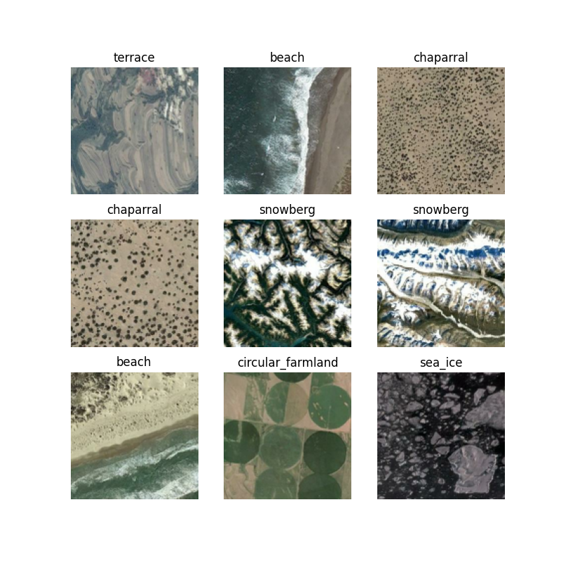

## CNN Satelite Image Classification
Convolutional Neural Network for Multiclass Image Classification using Tensorflow. 

## Stack
- **Tensorflow**: loading data, preprocessing data, cnn, earlystopping, tensorboard.
- **matplotlib**: plotting pictures, losses and accuracies of the model.
- **seaborn**: confusion matrix heatmap. 
- **numpy**: preparing test score to confussion matrix. 
- **sklearn**: confusion matrix.
- **itertools**: preparation data to visualize number of classes.

## Dataset
The dataset was limited to a subset containing 10 classes from 45 provided. 
Every class has 700 pictures in 256x256 resolution (RGB). 
https://www.tensorflow.org/datasets/catalog/resisc45

## Results
For now, model can achieve up to 93% of correct classifications.

## Test Predictions Example

